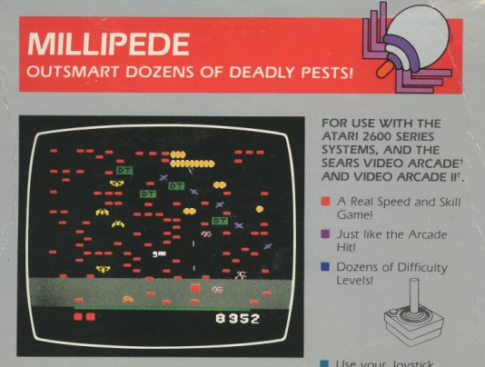
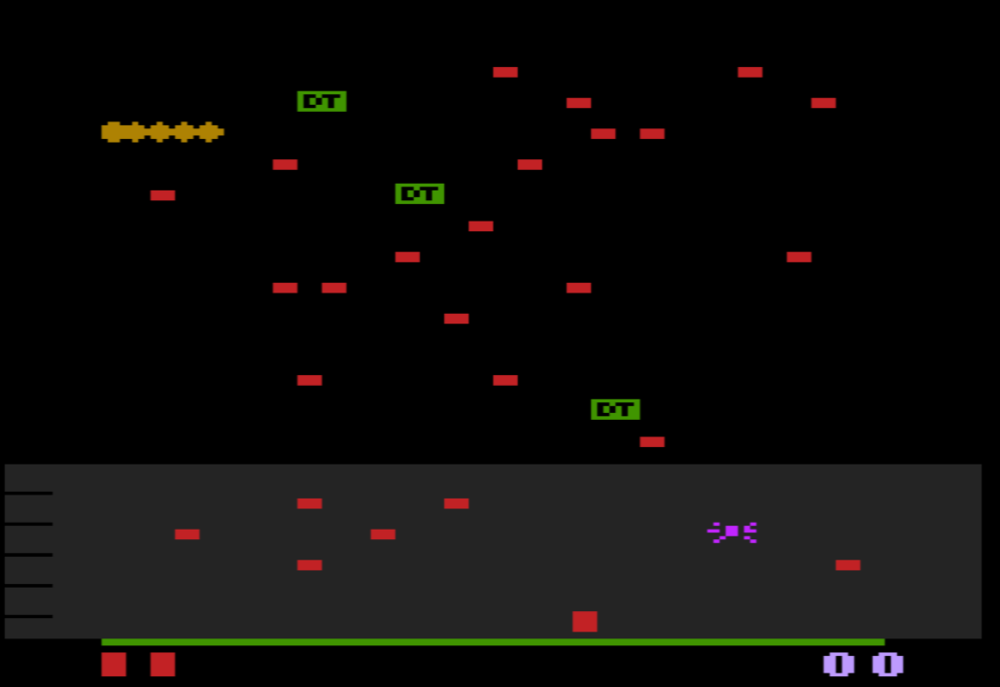

+++
date = '2025-02-06T09:00:00Z'
draft = false
title = 'Automating Television Setup'
+++

This article begins with a direct rebuttal of my own conclusions in the [previous article](). After much reflection and feedback I no longer believe it would be wise to have:

* a hue/phase setting in a hypothetical container format 

* a similar mechanism provided by a properties file. 
 
 The reason for this was expressed in the previous article, which highlighted the possibility of "palette abuse".
 
 In fact, it's worse than mere abuse. It would effectively create a new pseudo-console that allowed a cartridge to indirectly control the palette. This is obviously not desirable behaviour to be introduced by an emulator.
 
 <!--- more --->
 
### Hue Shifting
 
With regards to Gopher2600 specifically, I am still undecided whether cartridge specific phase/hue settings should be allowed _at the behest of the user_. In this proposed scheme the change to those settings would originate only with the user of the emulator and then automated thereafter.

However, there is a feeling in some quarters that such automation is _faking reality_. I disagree with this description. The reason for my disagreement is because both the phase and hue are, in fact, adjustable by the user of the real console.

Moreover, there are other television automations already in the emulator - for example, the choice of NTSC or PAL TV - I see no reason not to introduce another automation relating to phase and hue.

### The Krull Problem
 
 The need for such automation is strongly supported by the existence of the _Krull_ cartridge.
 
 There is strong evidence that the developer, David Staugus, was using a different hue setting to the one indicated by the colour tables in both the _TIA\_1A_ and _JAN_ documents. I believe that this information should be presented in some way by the emulator.
 
Now, in the case of _Krull_ only the hue seems to be different. There is no evidence that the phase is substantially different. So maybe any palette adjustment mechanism should only affect the _hue_ of the palette. This would be more reflective of reality perhaps.

The case for automation would be even stronger if there was another example of a cartridge similar to _Krull_. The best candidate was the other 2600 game developed by David Staugus, _Millipede_.[^millipedebox]

Alas, _Millipede_ does not exhibit the same problem. _Krull_ is the only example so far, in which the hue shift is significant.[^atlantis]

[^atlantis]: _Atlantis_, as mentioned in the previous article, also seems to have a different hue to say _Pitfall_, but the difference is less clear in that case. I would go so far as to suggest that in the case of _Krull_ the difference is inarguable.

#### _A note about the screenshots_

_The images in this article were produced by the, as yet, unreleased second preview of v0.40.0 of Gopher2600. For this preview the way the I and Q values are calculated has been changed. The changes result in more vivid image._

_In the first preview of v0.40.0, the I and Q values were scaled by the Y component. This led to a less saturated value the further down the luminance scale the colour-lum value was._

_I do suspect saturation is affected by the luminance but I'm not currently sure what the coefficient should be. For now, a coefficient of 1.0 is being used._ 

### Conclusion

For now, the decision to add an _automatic hue shift_ feature is deferred until there are more examples of cartridges that require it.

However, in my opinion, the automation of television setup is an undeniable requirement for an emulator. We already accept the automation of whether the cartridge requires an NTSC or PAL television, but the extent to which automation goes remains an open question.

[^millipedebox]: Images of the Millipede box art from [atarimania](https://www.atarimania.com/game-atari-2600-vcs-millipede_s6810.html)
