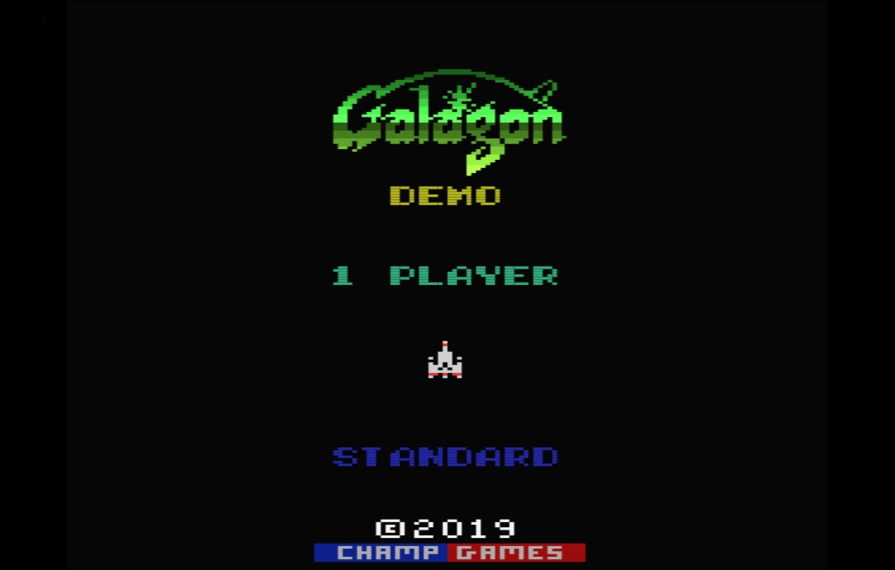
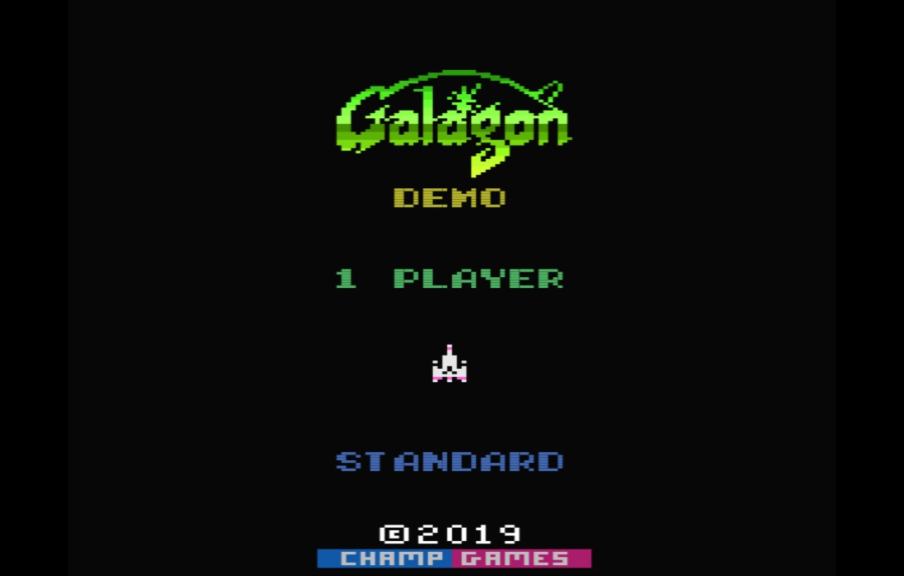

+++
date = '2025-04-30T06:00:00Z'
draft = false
title = 'Improving the NTSC Colour Model'
+++

This article is a continuation of the series discussing the Atari 2600 colour generation model. In the [first article]() I described how each colour in the 2600 palette can be thought of as a position on a colour wheel. In particular, I focused on how each _hue_ in the palette is positioned at a fixed location relative to the _colourburst_ and according to a _phase_. I described how the phase can be adjusted by the _colour delay potentiometer_ and there was a discussion about what the "correct" phase value should be.

In that first article I also described how using a preset palette of RGB values was unsatisfactory because the phase of the palette could not be altered. I now realise that this is a false conclusion and the phase of a preset palette _can_ be altered and indeed, can produce superior results. This article describes a new model that makes use of a standard RGB palette while maintaining the ability to adjust the palette's phase.

Before looking at how phase adjustment of an RGB palette is possible, let us first examine the problems created by what I will refer to in this article as the _mathematical model_.

<!--more-->

### Limitations of the Mathematical Model

The fundamental problem introduced by the mathematical model is that it simply doesn't produce the _exact_ colours that people expect. The model can be calibrated so that it is close but there are always subtle differences which are intolerable.

Even when we take into account calibration differences suggested by different references manuals and test cards, or accounting for differences like those seen in [vintage games](), we still cannot get close enough to expectations in some important cases. 

I was first alerted to this by the difference in the game _Galagon_, by _Champ Games_. Like all games from this publisher, the colours seen on the screen are very carefully chosen so that they match the original game as closely as possible. When the game is rendered using the mathematical model however, some of the colours are noticeably different.

In this first image, we see the Galagon title screen rendered with the colours preferred and expected by the graphics artist (Nathan Strum).

This second image is the same title screen rendered using the mathematical model. As can be seen the colours, although _broadly_ correct are none-the-less incorrect if artistic precision is what we're interested in. 

The model in this case was calibrated using the _Field Service Manual_ as a reference. That is, the phase was set to 26.7° and the colour-burst set to 32.72°. We can adjust these values (along with the contrast, brightness values, etc.) and get closer to Nathan's intended palette but it's not possible using the mathematical model to get it exactly the same.

### A Problem of Calibration

On the surface this seems to be another example of a game being designed according to a wildly different calibration. We've shown how [Krull]() was almost certainly developed with a poorly calibrated television, either accidentally or not. Maybe we just need to accept that 2600 games will never have a unified palette and that Galagon is another example of this. However, this would be misunderstanding the lesson given to us by Galagon.

Unlike historic games, I am certain that Galagon was developed with the aid of an accurately calibrated television. If it wasn't clear before then it is certainly clear now that the mathematical model so far developed is too simple and with too many incorrect assumptions.

It _should_ be possible to calibrate the model so that that it matches the first image above. The fact that it cannot teaches us that we are missing important details in the model. For instance, I believe that there must be additional coefficient applied to the colour phase value.

Alas, the nature of any coefficients are beyond the means of my understanding. The secrets of the coefficients will likely be discovered by an electrical engineer who can measure the electrical outputs from the hardware. But there is another way to attain the same information that is accessible to anyone. Indeed, people have already done this work indirectly.

### Observed RGB Values

The preset palettes that I discounted in the original article in this series, are encoded as RGB values. That is, each entry in the palette details the amount of _red_, _green_ and _blue_ in the colour.

The important point about these values is that they were arrived at through _observation_. In other words, the RGB values were selected by someone _observing_ the results on a real console connected to a real television.

This means that all the imperfections of the colour generation electronics in the Atari 2600 were indirectly observed and have been encoded in the RGB values of preset palettes. Whereas the mathematical model assumes evenly distributed phase values around the colour wheel, the observed RGB values implicitly contain the details of the imperfections. 

There is still the problem of whether the RGB selection was done by observing a _correctly calibrated_ console and TV but assuming it was, a preset palette is as close as we're ever likely to get.

### RGB to YIQ

It was the desire to emulate the _colour delay potentiometer_ that caused me to reject the use of a preset palette and it is true that we cannot directly apply a phase adjustment to an RGB value. What we can do however is convert the RGB values to a YIQ value and then further break that down to an angle on the colour wheel.

To help explain the conversion of RGB to YIQ, we can use the analogy of a television broadcast.

1. The camera gathers the RGB information
2. The RGB information is converted to YIQ for broadcast
3. A television receives the broadcast and converts the YIQ information back to RGB for display

We can think of step 1 as cross-referencing _hue-lum_ value with an entry in the RGB palette.

Step 2 converts RGB value is converted to a YIQ value. In line with TV broadcasting, we use the "NTSC 1953 colorimetry" values from the [YIQ article on Wikipedia](https://en.wikipedia.org/w/index.php?title=YIQ&oldid=1220238306) in our conversion.

	Y = 0.299*R + 0.587*G + 0.114*B
	I = 0.5959*R - 0.2746*G - 0.3213*B
	Q = 0.2115*R - 0.5227*G + 0.3112*B
	
To adjust the phase of the palette however (or the colour delay, as we might prefer to think of it) we need to determine the angle on the colour wheel of the RGB value. To do this we take the arctangent of I divided by Q.
		
	phi = arctan(I/Q)

Emulating the colour delay potentiometer is now a case of adjusting this phi value up or down by small increments. Note that unlike the mathematical model, we don't really care about the phase value. All we really care about is by how much the phi value is to be adjusted.

	phi -= (hue - 1)) * adjustment
	
There is an assumption here that the potentiometer itself doesn't affect anything other than the phase in a uniform manner. Further measurements by an electrical engineer or the equally laborious creation of many RGB palettes for comparison purposes, would reveal the true nature of the potentiometer. But for now this is a reasonable emulation of the component.

### Y, Phi, Saturation 

The key components for recreating the (phase adjusted) RGB values are the Y and Phi values shown above, and also the saturation value.

The saturation value of the unadjusted RGB value can be obtained by taking the square-root of the sum of the squares of I and Q.

	saturation = squareroot(I^2 + Q^2)
	
To complete the TV broadcast analogy, we convert the YIQ value back to RGB in step 3:

	I := saturation * sin(phi)
	Q := saturation * cos(phi)

	R = Y + (0.956 * I) + (0.619 * Q)
	G = Y - (0.272 * I) - (0.647 * Q)
	B = Y - (1.106 * I) + (1.703 * Q)
	
The Y, Phi and Saturation values are also the key components of the mathematical model. The difference is in how they are derived. 
Just as the mathematical model assumes equal phase distribution around the colour wheel it also assumes an equally distributed Y value between a min and max of 0.0 and 1.0; and also a fixed saturation value of 0.3.

As an example of how this assumption about saturation is wrong, the table below shows the saturation values for all eight luminances of Hue-1 in the observed RGB palette.



| Lum 0 | Lum 1 | Lum 2 | Lum 3 | Lum 4 | Lum 5 | Lum 6 | Lum 7 |
|-------|-------|-------|-------|-------|-------|-------|-------|
| 0.126 | 0.158 | 0.184 | 0.210 | 0.235 | 0.256 | 0.277 | 0.295 |

The value of 0.3 is approximately correct but it's certainly not accurate.

### Conclusions

The original article in which I described [the NTSC colour problem]() incorrectly stated that it was impossible to change the phase of a preset RGB palette.

The original article did acknowledge that the _Brightness_, _Contrast_ and _Saturation_ of an RGB palette can be adjusted but did not go into details. In fact, the best way of adjusting these properties is to convert the RGB value to YIQ values first, and to convert back to RGB once the adjustment has been made. It was my error to not see that the YIQ value could be further decomposed into a phase and an implicit saturation value.

While the model described here successfully emulates the colour delay potentiometer, it does not solve all the problems of NTSC colour described in that first article. For instance, it does not address the issue of what the correct phase is - it only deals with adjustments to the phase. But maybe the value doesn't really matter. After all, the potentiometer in the console has no numerical indicator.

The model also doesn't address the issue of apparent variations in palette between different games, particularly vintage games.

What it does allow us to do however, is to use a "standard" palette used in modern game development and which meets people's modern expectations; while also giving us as much control over the palette as is allowed by the emulated hardware (ie. TV controls and colour delay potentiometer). 
