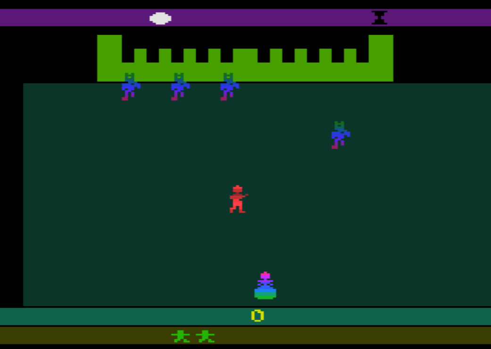
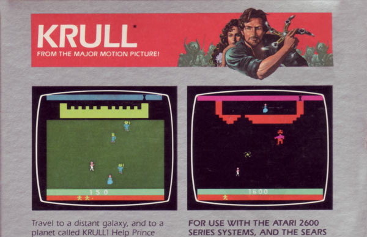

+++
date = '2025-01-27T19:00:00Z'
draft = false
title = 'NTSC Colour In Vintage Games'
+++

In the previous article while discussing [the NTSC colour problem]() I said that examining vintage 2600 ROMs would be an informative exercise. That is the purpose of today's article.

While selecting ROMs to examine for this exercise, I looked for games with colour for which there are secondary reference points. For example, an image in a manual or on a game box to make comparisons with.

Games based on other items/products in popular culture might also be useful. For example a movie or a TV show.

We might also look at ROMs in which realistic items appear and which are unambiguously of a specific colour. For example, a river is usually blue. 

The problem however is that most hues in the 2600 palette do not change very much when the phase changes. So using a game to help discern the "correct" phase is difficult.

For instance, blues are not great for comparison purposes because they appear only half-way around the colour wheel and so do not move much when the phase changes.

The following image shows the three palette phases considered in the previous article.

As can be seen, for most of the hues the differences are very small. To help prove this point we'll use the game _Smurf: Rescue in Gargamel's Castle_.

The Smurf on the left has been rendered with a 26.7° palette, while the Smurf on the right is using a 25.7° palette. The differences are very slight, maybe even imperceptible. Blues are not helpful for our purposes.

However, there is a more noticeable change between the three palettes when looking at hue-14 and hue-15. In the 26.7° palette, hue-15 is more noticeably orange and hue-14 appears more brown than green.

A great example of a ROM that uses hue-14 is _Space Invaders_, developed by Atari and released in 1980. 

In the image above, the ground on the left half of the image is using a 26.7° palette and appears brown or khaki. The ground on the right meanwhile, is using a 25.7° palette and is more green.

The problem however is that the Earth, which the ground is representing, could easily be brown _or_ green. Either colour seems reasonable!

Maybe a photograph of the game running on a TV of that era might help. Thankfully, there are recordings of [television commercials](https://youtu.be/jMLhvlAxsPw?t=20) that we can compare results with.

It's blue!

Alas, these old recordings are next to useless for our purposes. There is too much uncertainty introduced by the filming process, the subsequent recording onto tape and finally the encoding to a digital file for uploading to YouTube. On top of that, who's to say the TV they used was calibrated correctly anyway?

It is disappointing but I don't believe vintage games can tell us very much about palette phase. It would be very difficult to discern what phase a developer was using just by examining the colours on the screen.

Based on the two examples presented here and a handful of others that I've examined, the best we can say is that the phase should be set somewhere in the 25.7° to 26.7° range. A belief that is in agreement with the conclusions in the previous article.

### Hue

However, there is one other palette control that we haven't really talked about and which does appear to be something that consumers were expected to adjust according to the game being played. That control is the _Hue_ control.

There are two very dramatic examples, both from the early '80s and both developed and published by reputable companies. The games are _Krull_ and _Atlantis_ from Atari and Imagic respectively.

### Krull

_Krull_ is a game released by Atari in 1983 and based on the movie of the same name. The action takes place on an alien planet and so _any_ colour might seem reasonable, but none-the-less there is much we can learn.

To the casual observer the title screen looks fine, although maybe a little dull. The hills and the ground are green, which is what we would expect. The logo is a nice vivid yellow, which also seems fine.

The first game screen however is very different. Even without knowing anything about the movie, it looks wrong.

At the top of the playfield there is what looks to be a castle with battlements. Why is it green?

The main playfield meanwhile, is a strange teal colour. and the time-of-day indicator at the very top of the screen is purple? The sky can appear purple (particular when on an alien planet) but this specific shade of purple doesn't seem like a good choice.

Helpfully, the packaging for the game includes an artistic impression of the play screen. Boxes and manuals of the time tended to include artwork like this rather than actual screenshots, so we can't always be certain that the colours are accurate, but in this case the artwork provides excellent clues to what was intended.[^krullbox]

Looking at the screen on the left of the box and comparing it with our screenshot, we can see castle walls that are more yellow, a playfield that is more green, a sky that is more blue and red bar across the bottom rather than the brown we see in our screenshot. We might also notice that the player is pink rather than red.

We could try adjusting the phase to try and get a better match but this does not produce optimal results. Also, remember that changing the phase does not change the lower numbered hues very much. In this case, we want the red of the player character to turn to pink.

Moreover, I can't believe that game developers expected people to adjust the phase pot for every game. In this instance, it is far more believable that we are expected to adjust the TV's hue.

The change is dramatic and to my eyes the results are far more pleasing and match the artwork more closely. The castle walls are yellow, the playfield is green and the bar at the bottom is orange-red. My only quibble is that sky is still purple but it is a much less vivid purple.

In this screenshot the entire palette has been rotated _anti-clockwise_ by 35°. In colour wheel terms this is what the new palette looks like.

It should be emphasised that this adjustment of 35° is very much driven by the default colourburst rotation decided upon in the previous article.

I chose a colourburst rotation of 57° which means that the Krull specific adjustment of 35° results in an _effective_ colourburst of 22°.

	colourburst - adjustment = effective_colourburst
	
Or 
	
    57° - 35° = 22°

### Atlantis

The second game in which we can see an improvement after a hue rotation is Imagic's _Atlantis_. This game is not based on a movie but it does include real-world parallels and artwork that we can draw upon for clues.

Here is the main screen using the default colourburst rotation of 57°. As we can see the water in this screenshot is a disappointing teal.

Our suspicion that the water is the wrong colour is confirmed by the box art for the game. [^atlantisbox]

Like we did with Krull we once again adjust the hue so that the colours appear correct.

In this instance however, we rotate in the opposite _clockwise_ direction. We now see the blue water and we also notice that the three island cities are turquoise, just like they are in the box art.

This palette was created with a hue adjustment of 30° in the _clockwise_ direction, resulting in a colourburst rotation of 87°.

    57° - -30° = 87°

### Effects On Other Games

At this point we might conclude that the default colourburst rotation of 57° is wrong. However, I think that rather misses the point of what we have learned from the evidence of Krull and Atlantis.

The adjustment to the colourburst in the two games we examined are in _opposite directions_ to one another. In the case of Krull we rotate 35° in an _anti-clockwise_ direction. While in the case of Atlantis we rotate 30° in a _clockwise_ direction. That's a difference of 65° with the default colourburst being more-or-less in the middle.

Moreover, if we were to select one of these alternative adjustments as the preferred default, it would have a negative effect on other games. It wouldn't really improve matters.

To demonstrate this point, here are two images of the familiar Pitfall, first with the Krull colourburst and secondly, with the Atlantis colourburst.

Neither looks correct to my eyes although the Atlantis palette has at least preserved the general colour scheme and the blue of the water in particular. However,  I also think it looks too green and washed out.

The Krull palette meanwhile, is clearly not what was intended by the developers but it is at least interesting and vivid when compared to the Atlantis palette.

Either way, I would much prefer to play with the following palette which was generated using the default colourburst rotation.

In other words, if either the Krull or Atlantis rotation was the default setting, I would choose to use a 57° rotation when playing Pitfall. There really is no one answer that can satisfy us in all cases.

### Conclusions

That there are games in the vintage collection that use an alternative palette is undeniable. Whichever way we look at it, there are three games highlighted here (Krull, Atlantis and Pitfall) that seem to look best with a different hue adjustment (or colourburst adjustment, if we prefer to think of it in those terms).

In the previous [article]() I tried to reason about default settings using historic documents. In particular, the colour descriptions in those documents were used as a reference. I believe a default colourburst rotation of 57° and a phase of 26.7° is as close to the _intended_ palette of the _TIA\_1A_ document (and other sources) as it is reasonable to get.

The problem now is what to do with the exceptions to the rule.

The first thing to say is that I don't believe it is necessary to add arbitrary palette support to Gopher2600. All practical palettes can be created using just the hue and phase controls. The brightness, contrast and saturation controls can further enhance the palette to the user's taste.

What is required is a standard way of indicating to an emulator what the preferred hue/phase is for individual games. I see three possible solutions, which would work individually or together.

1) The semi-standard _stella.pro_ file could be expanded with a hue/phase field. Alternatively, a standardised notation could be developed for use in the existing notes field.

2) A standardised notation could also be used in the filename of a ROM. Although this would be a clumsy solution, it would work as a fallback.

3) The third option is to create a new container format similar to the existing _.a78_ container format used by 7800 emulators. A container format for the 2600 would include the ROM's name, publisher, etc. in addition to TV specification, controller requirements and also the preferred phase and hue.

Proposal three would require significantly more work than the other two options, and would also require coordination with other developers and projects. 

 A possibly controversial side-effect of these solutions might be on new games going forward. Adding hue and phase metadata to a ROM is intended to get the best out of vintage games. However, it could easily be abused by new games wishing to create a more eye-catching palette.
 
 On the other hand, maybe that's not a bad thing. Phase and hue are after all, two variables that exist in the 2600/TV system already. There is nothing currently stopping developers from providing instructions like "best viewed with phase 24° and hue 90°". An emulator that understands the metadata would automate those instructions.
 
 Encouraging that behaviour however would reduce physical cartridges on vintage hardware to second class citizenship and that's something we should never seek to do. If we do add phase/hue metadata then such palette abuse should be discouraged.
 
[^krullbox]: Images of the Krull box art from [atarimania](https://www.atarimania.com/game-atari-2600-vcs-krull_7365.html)
[^atlantisbox]: Images of the Atlantic box art from [atarimania](https://www.atarimania.com/pgesoft.awp?version=20845)

