+++
date = '2025-01-25T13:00:00Z'
draft = false
title = 'The NTSC Colour Problem'
+++

During the recent development work on v0.40.0 of Gopher2600 I decided to do work on the NTSC palette and in particular, how the colour values are derived. This work has been on my personal TODO list for many years but I never found a reason to take a closer look.

When I finally did look I was a little surpised. I was aware that there were differing opinions on what the NTSC palette should be but what I didn't realise was how fundamental to the 2600 this disagreement is.

The immediate prompt for this work was [this thread](https://forums.atariage.com/topic/375698-how-are-ntsc-console-colors-really-set-up/) on AtariAge. It's a long thread with lots of confusion (some of it my own) but it's worth reading through.

The purpose of this article is to provide a background to what the NTSC colour problem is, what the causes are, how to resolve it and how it affects 2600 emulators.

There is less controversy over the PAL and SECAM palettes (as far as I can tell) so they won't be discussed at all in this article.

<!--more-->

### Background

While it is true to say that there is a general consensus on the NTSC palette (e.g. reds are generally agreed to be red by everyone) the precise palette is not agreed upon. The ultimate cause of the disagreement seems to be the behaviour of a potentiometer found on the motherboard of the console. This is more properly known as the _colour delay_ potentiometer and governs precisely when during the machine cycle the colour signal is generated. 

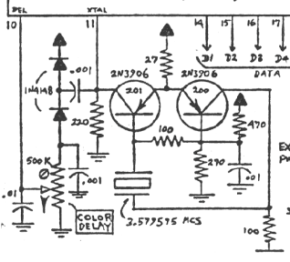

(Gopher2600 only emulates the behaviour of the digital electronics in this part of the console. I don't believe simulation is necessary in this instance and so the schematic above is presented for context only).

The _colour delay_ potentiometer (hereafter known as the _pot_) can be adjusted so that the generated colours match Atari's intended palette. I believe the pot is present on the console so that variances in the console's electronics can be smoothed out at the time of manufacture. It is only when the console is powered on for the first time that the spectrum of colours can be seen for that console. The intention I believe, is for the console to be tuned in the factory using the pot.

The pot can also be adjusted by the end-user. This continued through all editions of the console until the release of the relatively rare, single chip 2600, sometimes referred to as _Janice_. In this edition of the console the _pot_ is not present at all. This means that the _Janice_ chip can only ever output one set of colours.[^janice] This article will consider the significance of this.

In addition to the pot, the value of the so-called _colourburst_ isn't entirely clear. This article doesn't go into a great deal of detail on this but it is an important value to get right. The article briefly explains the reasoning behind the chosen value.

On top of the uncertainty about the console itself, the television can also be tuned in different ways. In addition to the usual _Brightness_, _Contrast_ and _Saturation_ controls, a television oftentimes has a _Hue_ control. The first three controls affect the colour in a relatively subtle manner, but the _Hue_ control alters the palette in a more fundamental way. 

For the most part all these problems go uncommented on, which is probably for the best, but it's definitely a problem that Atari 2600 emulators need to consider. People have different experiences, memories and therefore expectations of the hardware. The emulator, because it provides a common and present-day experience, causes these expectations to collide. 

The goal for Gopher2600 therefore, as it should be for any emulator, is to:

1. Give the user the freedom to control their own experience.[^goals]

2. Provide a reasonable default value.

The second point is the crux of the entire problem. What should the default be? What was Atari's intended palette?

### Preset Palettes

The simplest solution to the colour problem is to use a preset palette. In this solution the colours are not generated but are  looked up from a precompiled table. The table that maps a _Colour-Lum_ value to an _RGB_ value. This is an acceptable solution and is what Gopher2600 up to [version 0.35.3](https://github.com/JetSetIlly/Gopher2600/releases/tag/v0.35.3) did.

The preset palette of course needs to be compiled by someone. In the case of Gopher2600 the RGB values were copied from [this page](https://www.qotile.net/minidig/docs/tia_color.html). Another good source for the RGB values would have been the NTSC palette on [Random Terrain's page ](https://www.randomterrain.com/atari-2600-memories-tia-color-charts.html). I am not sure how the colours in these palettes were compiled originally but a good way (the way I would do it at least) would be to evaluate the on-screen colours generated by a real Atari and converting them to RGB values.

Why I preferred the _qotile_ palette over the _random terrain_ palette is now forgotten, but the very fact there is a choice to be made rather justifies the questions being asked in this article.

As it happens, the difference between these two particular palettes is only a difference in _Brightness_, _Contrast_ and _Saturation_. While the differences may look stark they can in fact be resolved very simply with relatively simple mathematics. We can think of the differences between the palettes as being differences created by the familiar controls on the television.

What we cannot change about these preset palettes however, is the _phase_ of the palette. If we want to give the user the full range of the 2600 experience we must allow them the ability to change the phase. The preset palette solution is not sufficient for this.

Before explaining what _phase_ is we should first make sure we understand what we mean by the terms _colour-lum_, _hue_ and _luminance_.

### Colour-Lum Values

In the 2600 memory there are four registers that control the colour of the seven basic elements of the graphical system. The _Stella Programmer's Guide_ refers to these as _Colour-Lum_ values.



| Register | Elements                      |
|----------|-------------------------------|
| COLUP0   | Player 0 and Missile 0        |
| COLUP1   | Player 1 and Missile 1        |
| COLUPF   | Playfield Foreground and Ball |
| COLUBK   | Playfield Background          |

Each colour register is eight bits wide but with an unused _least significant bit_. The upper nibble represents the _hue_ of the colour and the lower nibble (with the unused bit) represents the _luminance_ of the colour.

If we need to separate the hue and luminance values we can do something like this:

	lum = col & 0x0e
	hue = (col >> 4) & 0x0f
	
### Luminance and Hue

_Luminance_ can be thought of as the _intensity_ of a colour, or how bright it is. _Hue_ describes the _shade_.

To help clarify the difference in meaning of these two words we'll refer to this image of a colour wheel.[^shadertoy]

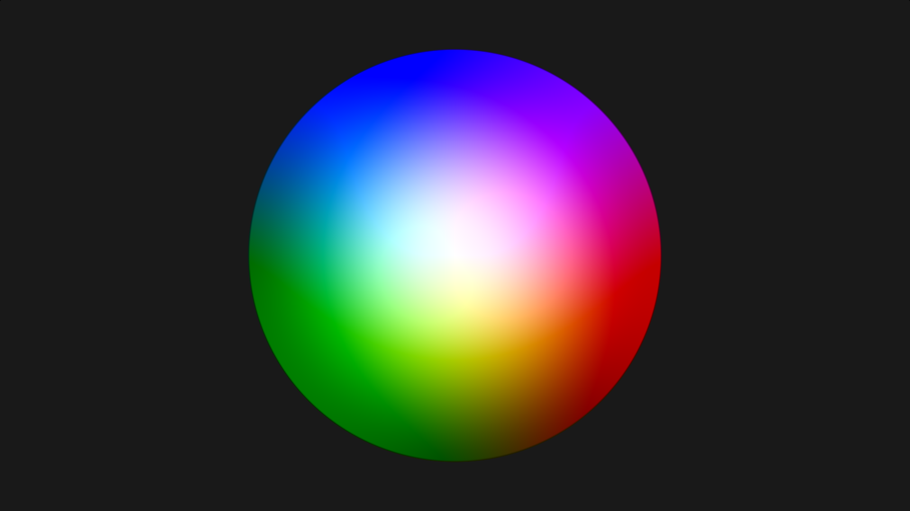

Looking around the outside of the circle we can see the colours move from blue to green, to red and so on. This is the _hue_. Note that we are moving anti-clockwise around the wheel.

Stopping at any one hue and then moving towards the centre of the circle, we notice that the brightness of the hue changes. This is the _luminance_.

So a _colour-lum_ value will always correspond to somewhere on this colour wheel. The upper nibble describes where on the outside of the wheel the colour is and the lower nibble describes how far from the centre it is.

### Mapping Colour-Lum to the Colour Wheel

How do we decide where on the colour wheel a hue value resides? This is where things get tricky and where much of the controversy lies. We'll deal with the _ideal_ answer first.

Hue value ranges from 0 to 15. Value 0 is a special case which we won't deal with in this article. The other 15 values are _ideally_ distributed evenly around the colour wheel. By definition the wheel is 360° so dividing the wheel into 15 even parts gives us 24. In other words, there is 24° between each hue value.

This is what we mean by the _phase_ of the palette. In the _idealised_ palette, the phase is 24°.

By _ideal_ we don't mean this is the phase as it was calibrated in the factory. It simply means that this is the value that gives us the broadest range of colours around the wheel. In an ideal world 24° would be the phase angle.

The image below shows the positions of the 15 hues on the ideal colour wheel. The red square indicates where hue-1 (with an angle of 0°) is positioned. Hue-2 is the next square in the anti-clockwise direction; Hue-3 is the next one after that; and so on. Hue-15 is indicated by the light blue square.

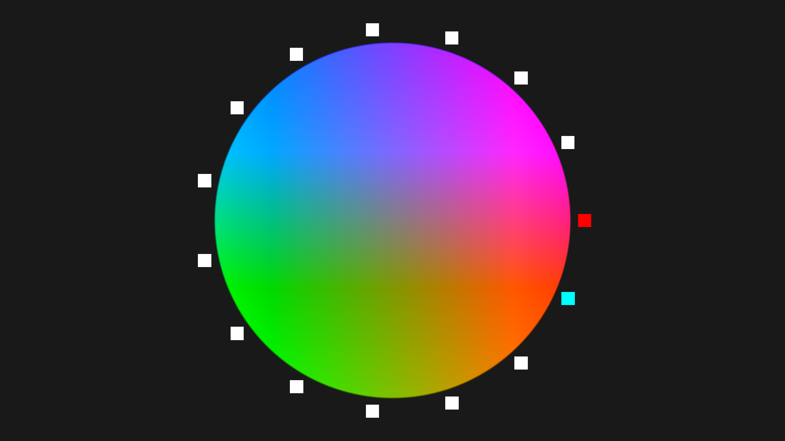

(Note that in this particular colour wheel the _luminance_ is fixed).[^fixedluminance] 

### Colourburst

Immediately we can see the colour wheel is wrong because hue-1 should be gold or light orange and not the pink/purple suggested by the colour wheel. How do we know this? Because various reference documents originally from Atari say that they must be. The first image below is an excerpt from page 24 of a document referred to as _TIA\_1A_.

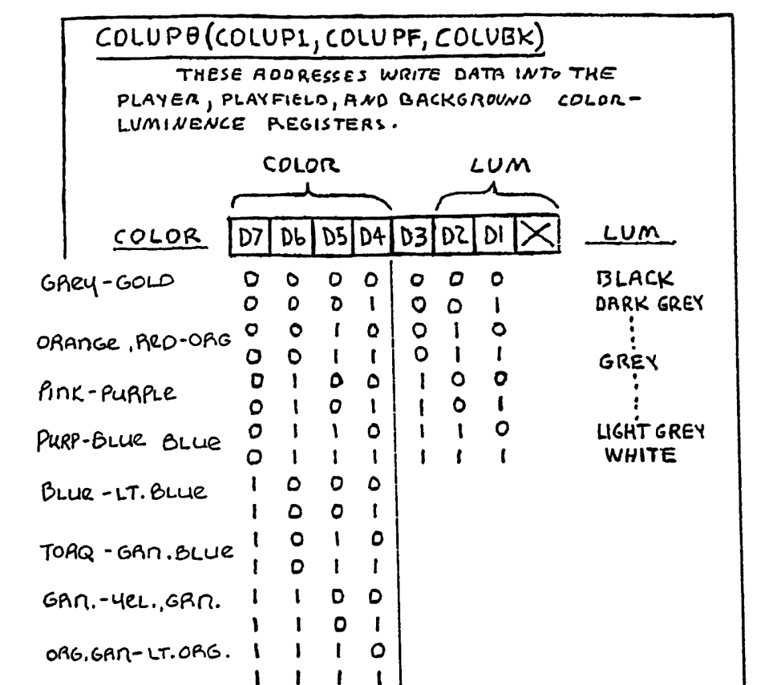

This second image is an excerpt from page 40 (section 7.8) of the _JAN_ document. As the name suggests the _JAN_ document deals with the operation of the _Janice_ edition of the console. The Janice chip dates from 1988 and so this is likely the most recent historical document in which we will find a description of the colours.

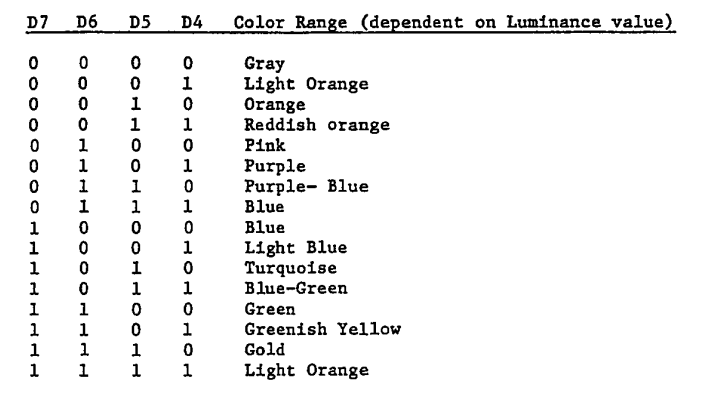

The descriptions in both tables are the same except for the descriptions of hue-1, hue-14 and hue-15. For now we're focusing on hue-1 which is described as either _gold_ or _light orange_. We can say that according to both of these documents hue-1 should be in the orange quarter of the colour wheel.

Hue-1 is also referred to as the _colourburst_. Page 11 of _TIA\_1A_ says that _"Code 1 selects gold (same phase as the colour burst)"_. 

To correct the value of the colourburst, and therefore hue-1, I'm simply going to _rotate_ all the points on the colour wheel such that hue-1 is "correct". For the purposes of this document this means rotating all the squares clockwise by 57°. The red square of hue-1 is now firmly in the orange section of the wheel.

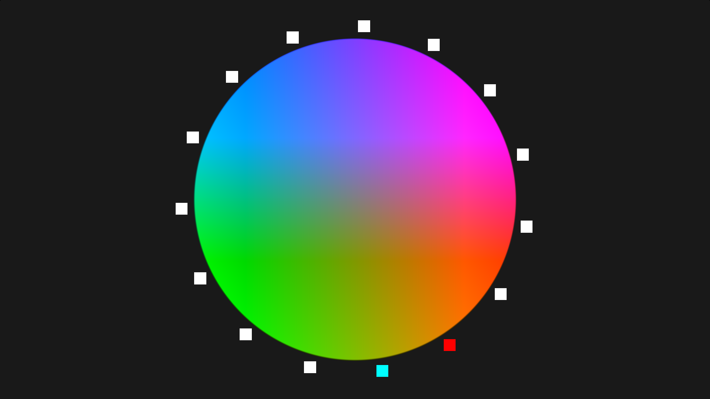

There's more to be said about the angle of the colourburst and how it's derived. I'll update this article once I'm completely satisfied with my own understanding. But either way, it doesn't really matter what the precise angle of the colourburst is because it is _defined_ to be gold/light-orange. The conscientious console owner will eventually adjust the TV so that hue-1 looks correct and so all we're really doing here is pre-adjusting to the final hue rotation.

### Phase Adjustment

The phase has a far greater influence on the final palette than the colourburst. By identifying the correct phase we should be able to get closer to the other colours described in the tables quoted above. We've established that hue-1 must be in the orange quarter of the colour wheel. But what about the other hues?

Turning our attention to hue-15 we can see that its position on the wheel is almost certainly wrong. Both colour tables describe hue-15 as being light orange, whereas in our adjusted colour wheel hue-15 is on the orange-green boundary. We can indirectly change the position of hue-15 by adjusting the phase.

Adjusting the phase causes the positions of all hues except hue-1 to change. This is because the phase is the angle to the next hue in the sequence and hue-1 being the first in the sequence is where ever we've placed it during our colourburst correction (previous section).

Applying the phase angle to each hue in the sequence means that the effect of a change in phase is greater the further up the hue sequence we go. This means that a change of 1° will translate to a change of 15° between hue-1 and hue-15. The practical effect of this is that hue-14 and hue-15 in particular can be changed a lot by a relatively small change of phase, while the lower numbered hues (hue-2, hue-3, etc.) change relatively little.

### Phase 25.7° 

So if the phase is not 24° what should it be? The colour description of hue-15 in the colour tables gives us a clue.

Hue-15 is described as _light orange_ in both colour tables. In the case of the table from the JAN document this is exactly the same description that is given to hue-1. Based on this we can assume that JAN expects hue-1 and hue-15 to be the same colour. 

In colour wheel terms this means that the position of both hues should be the same. To achieve this we divide the wheel by 14, resulting in a phase of 25.7°.

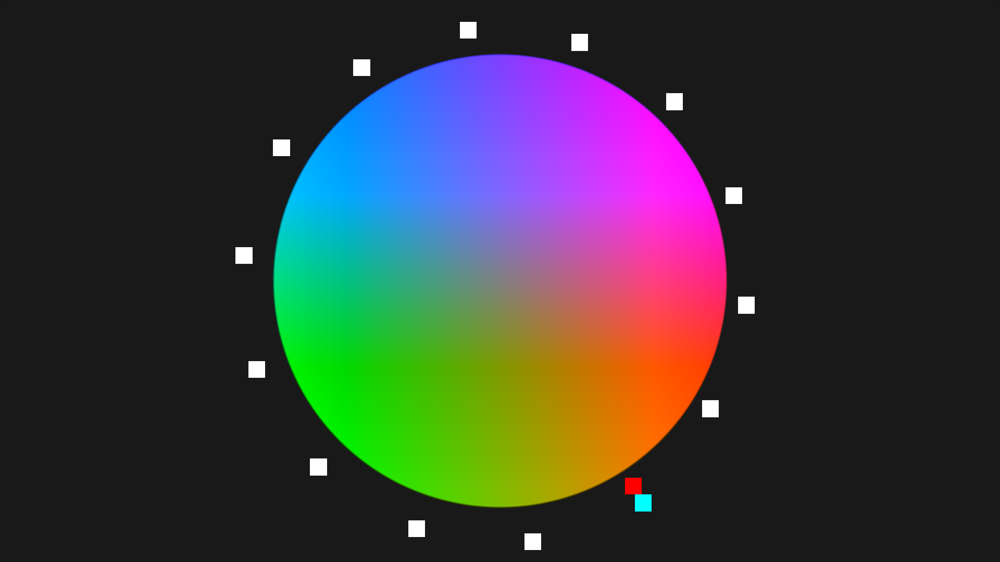

The colour wheel above show the markers with the larger phase of 25.7°. Note that hue-15 is now in the same position as hue-1.

Also note that it is now hue-14 which is on the orange-green boundary, which matches the description of hue-14 in the TIA\_1A document but not JAN.

The complication now is the differing descriptions for hue-1 and hue-15 in the TIA\_1A document. If the positions of the hues are exactly the same then surely the desciptions should be too.

We need further help. What other historical information is there to help us discern what the correct phase is?

### VideoSoft Test Pattern Cartridge

The _VideoSoft Test Pattern Cartridge_ dates from 1983 and was marketed as a cheaper alternative to the professional pattern generators of that time but it can also be used to calibrate the console. 

As described in the [cartridge's manual](https://www.ataricompendium.com/archives/manuals/vcs/color_bar_generator.pdf), there are fifteen test patterns the first of which is for making sure the console itself is calibrated. The manual states that this pattern ensures that the _"phase angles are being properly generated"_. If this test card is wrong then the other test patterns dealing with colour are likely to be wrong also.

The manual also says that the way to determine correct calibration of the console if for top and bottom halves of the "coloured box" to be as close in colour as possible. If the colours aren't close then the phase should be adjusted so that it is.

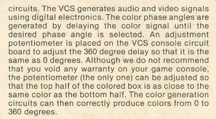

The two colours being compared on this test card are hue-1 and hue-15 so we can think of this as a shortened view of the colour wheel. In those terms, the test card is testing where hue-15 is in relation to hue-1.

To demonstrate what the test card looks like when the phase is wrong we'll use a phase of 24°. We've already discounted this phase value as being a possibility and the results shown on this test card clearly illustrates why.

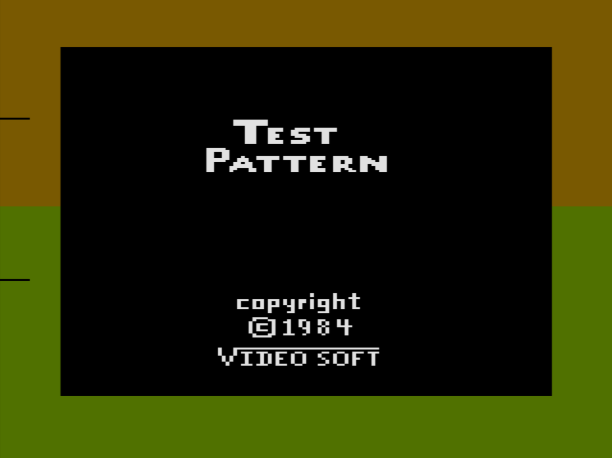

In this second image the phase has been set to 25.7°. The two halves of the screen are exactly the same, which is the result the manual suggests that we want.

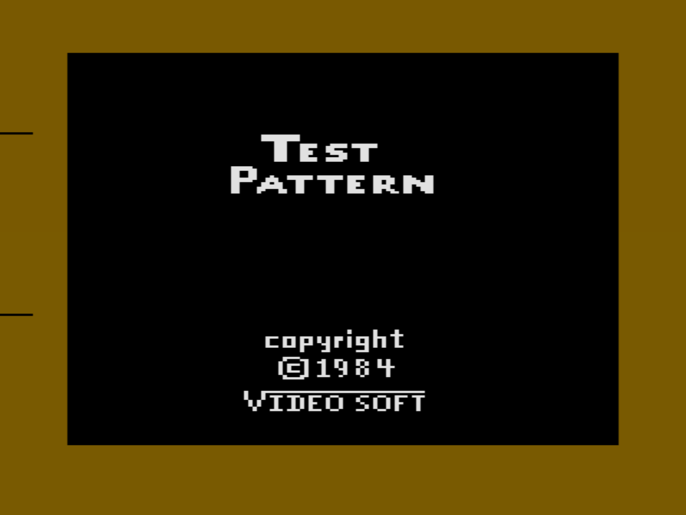

### Field Service Manual

Similar to the _VideoSoft Test Pattern Cartridge_ but less user-friendly is the _Diagnostic Test Cartridge v2_. This is an Atari produced cartridge and accompanies the substantial _Field Service Manual_. This manual covers all manner of tests that can be carried out by _"both experienced and inexperienced service personnel"_ (page vii). 

The test we're most interested in however, is the _Colour Bar Test_. A description of this test is given on page 3-9 of the manual. In reference to the colour delay pot, the manual says that it _"should be adjusted so the bars immediately above and below the reference line are within one shade of each other"_.

The reference line and the "two bars immediately above and below" are clearly indicated in the B&W image.

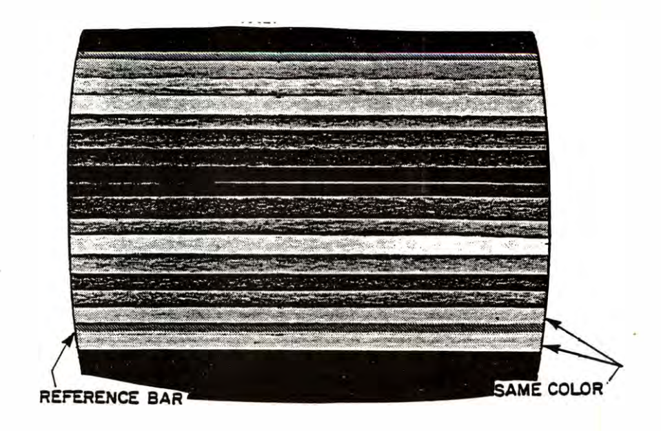

We immediately notice a problem. The text says the bars should be _"within a shade"_ and the illustration says they should be the _"same colour"_.

This is a perfect demonstration of the indecision and confusion that plagues this topic: a single page in a manual, created by Atari, that contains a fundamental contradiction.

### Phase 26.7° 

The Field Service Manual has given permission to try a phase where hue-1 and hue-15 do not exactly match. TIA\_1A supports the Field Service Manual because it gives different descriptions for hue-1 and hue-15. 

We've examined 24° and rejected it because the higher hues are too green. The Field Service Manual wants a hue-15 that is at least similar to hue-1 (ie. orange) and the description for hue-14 in TIA\_1A requires it to be orange-ish. This suggests that so we try a phase greater than 25.7°.

The following colour wheel has a phase of 26.7°.

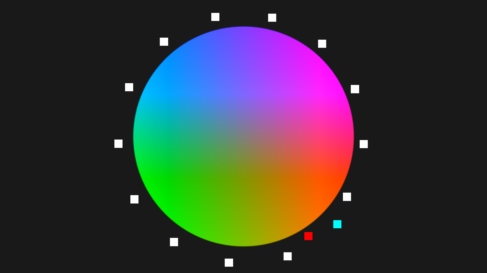

In this phase there are four hues in the orange quarter. The following table summarises what we can see in the _Orange_ column and compares it to the descriptions in the TIA\_1A and JAN documents.

| Hue    | Orange   | TIA\_1A      | JAN          |
|--------|----------|--------------|--------------|
| hue-1  | Light    | Gold         | Light Orange |
| hue-2  | Deepest  | Orange       | Orange       |
| hue-14 | Lightest | Orange-Green | Gold         |
| hue-15 | Deep     | Light Orange | Light Orange |

I personally think our observations more closely match the descriptions in the TIA\_1A document. The main problem for the JAN document is the fact that hue-1 and hue-15 have the same descriptions. For 26.7° to match the JAN table we must stretch the definition of _light orange_ to include several shades of orange. That's not unreasonable but it only leaves us to wonder why the descriptions where changed in the time between the two documents.

Returning to the _VideoSoft_ test card, the following image shows what 26.7° looks like.

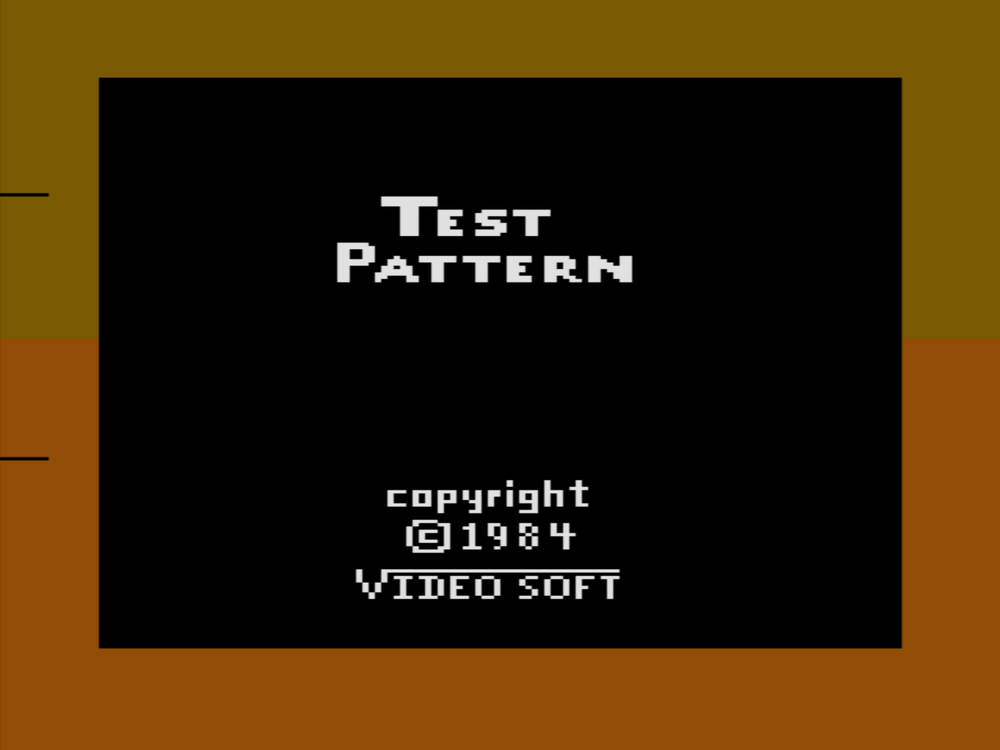

So not a match but "close" in the sense that they are both orange. We might even say that the top half (hue-1) is gold and the bottom half (hue-15) is light orange.

### Conclusion

This article is not an exhaustive exploration of the possible solutions to the NTSC colour problem. However, it does describe the nature of the problem and the merits of possible solutions. 

We've explained why a preset palette is not satisfactory and that generating the colours provides a better experience for the end user. The colour generating solution however requires that we choose a default value for the phase. Ideally the default value will be the intended value.

The article explored at length what the intended phase is. The only firm conclusion is that the mathematically obvious answer of 24° is wrong. No matter how pleasing that would be, it seems definite that Atari chose not to use that.

I think the reason why Atari didn't choose 24° during their design process is precisely because of the calibration problem and the presence of the pot. By requiring hue-15 to be either the same or to be very close, it is possible to show hue-1 and hue-15 on the screen at the same time, just as the _VideoSoft_ cartridge does. And because hue-1 never changes it is an excellent point of comparison when adjusting the pot.

However, having two hues that are _exactly_ the same is a waste, which is why I think the language of both TIA\_1A and the Field Service Manual encourage calibration such that hue-1 and hue-15 are _"within a shade"_. 

Either way, it seems there is no single answer and really comes down to belief. If we believe that hue-1 and hue-15 should be the same then the only answer is 25.7°. If we believe they can be slightly different then 26.7° is a good value although any value within reason could be permitted.

It's all very unsatisfactory but I think we can safely say that the intention is for the phase to be somewhere between 25.7° and 26.7°.

A special word about Janice. I don't believe the Janice document tells us very much and only adds to the confusion. The identical descriptions for hue-1 and hue-15 can only mean that 25.7° is correct. But that also means accepting that hue-14, described as gold in JAN, is more green than orange. That doesn't seem correct to me.

The other way to resolve the Janice colour table is to accept that _light orange_ can describe two different shades of _light orange_. That seems more plausible but it is once again, an unsatisfactory answer.

Looking at real life ROMs gives us some further clues. Curiously, commercial ROMs of the 1980s seemed to avoid using hues that were high up the palette. In other words it, hues 14 and 15 are not used very often. I think the reason for this is precisely because of the uncertainty over correct calibration. Activision for example, almost entirely avoid using hue-14 and hue-15 altogether.

The next blog article will examine some of these ROMs in greater detail to see if we can learn anything further.

[^goals]: Although I believe this freedom should be within limits. I don't think Gopher2600 should allow the user to create impossible palettes, for example.

[^shadertoy]: The images of the colour wheel in this article where created using [Shadertoy](https://www.shadertoy.com/view/M3tBRn).

[^fixedluminance]: The fixed luminance value for these colour wheels is 0.5.

[^janice]: We don't know how much variance there is between Janice consoles but it must be small enough for Ricoh (the licenced manufacturers of the Janice for Atari) to forego the addition of the pot.
