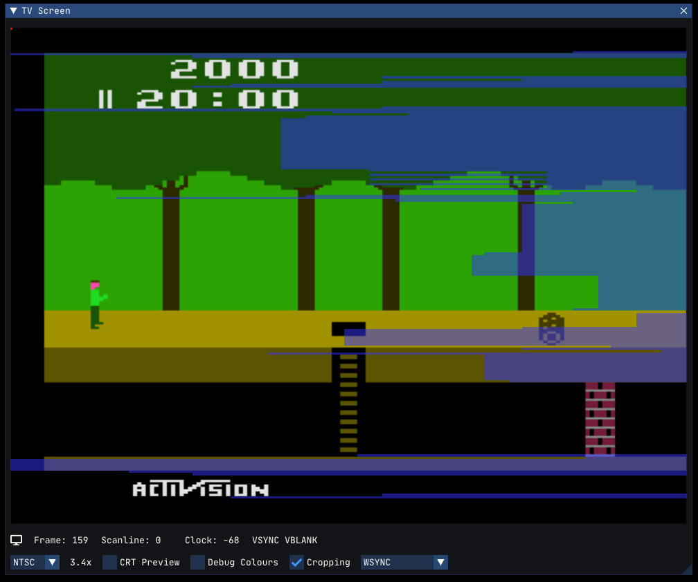

+++
date = '2025-01-04T16:09:26Z'
draft = false
title = 'The WSYNC Blog'
+++

I've decided to start a new blog with the intention of keeping track of Gopher2600 development and to log thoughts, interesting design decisions and future plans.

The first two articles have been taken from the "Current Status" page of Gopher2600 Wiki. I created that page in the summer of 2024 in order to explain the current development status of the project. I added to the page in November (2024) explaining what had happened since. I enjoyed the process of writing about the project but realised that I couldn't keep adding to the page indefinitely and that the wiki is not a suitable medium for this type of writing.

<!--more-->

### About The Name

The name of the blog is "Gopher2600/WSYNC". As anyone familiar with 2600 development knows, the WSYNC register allows the programmer to synchronise with the beginning of a scanline. During the WSYNC period, the CPU is idling waiting for the new scanline. And this is how I view this blog - a way for me to gather my thoughts and to synchronise with the next phase of the project. A little corny perhaps but I needed a name and it seems topical at the very least.

### WSYNC

While I'm thinking about WSYNC it would be a good time to highlight a unique feature in Gopher2600's debugger, the WSYNC overlay. The TV Screen window in the debugger can show additional information in the form of transparent overlays.

The image below demonstrates the WSYNC overlay using the starting screen for Pitfall as a demonstration.

The transparent blue lines represent the periods when WSYNC is active, or to put another way, when the CPU is idle. Thus, the overlay allows the programmer to quickly identify the areas where there is _potential_ for more useful CPU computations. Actually making better use of idle time is easier said than done of course, but being able to identify areas for improvement is the first step.

Another unique feature of Gopher2600's debugger is being able to run the emulation _in_ the debugger. Running _inside_ the debugger allows us to see the internal state of the machine changing. The video below shows how the calls to WSYNC change over time.



With the emulation running we can immediately see the sine-wave-like pattern of the WSYNC. In other words, the changes to the WSYNC pattern start slowly, then speed up, before slowing down again. If we're familiar with Pitfall we might recognise this as the way the ropes swing across the lakes and pits.

Indeed, if we move Pitfall Harry to a screen with a rope, we can see it swinging in time with the WSYNC. What's especially interesting to me is that this pattern can be seen even on the screens where there is no rope. An interesting curiosity of the game that wouldn't be immediately apparent without the visualisation.

