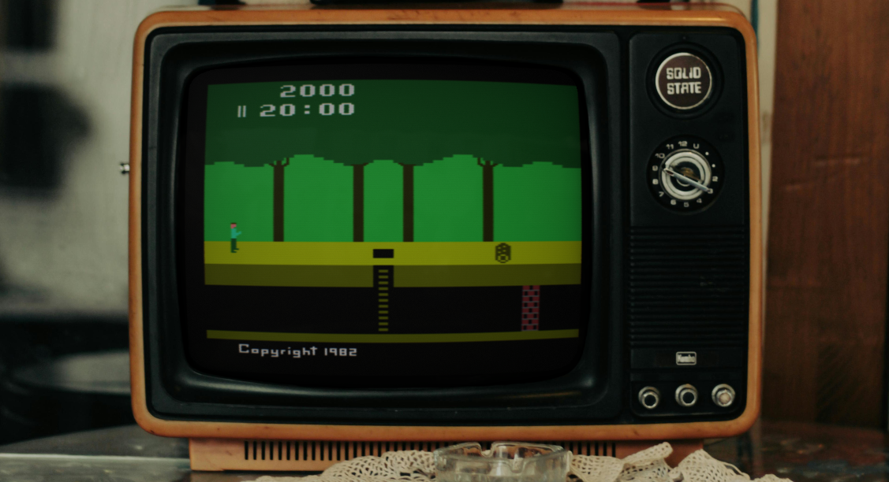
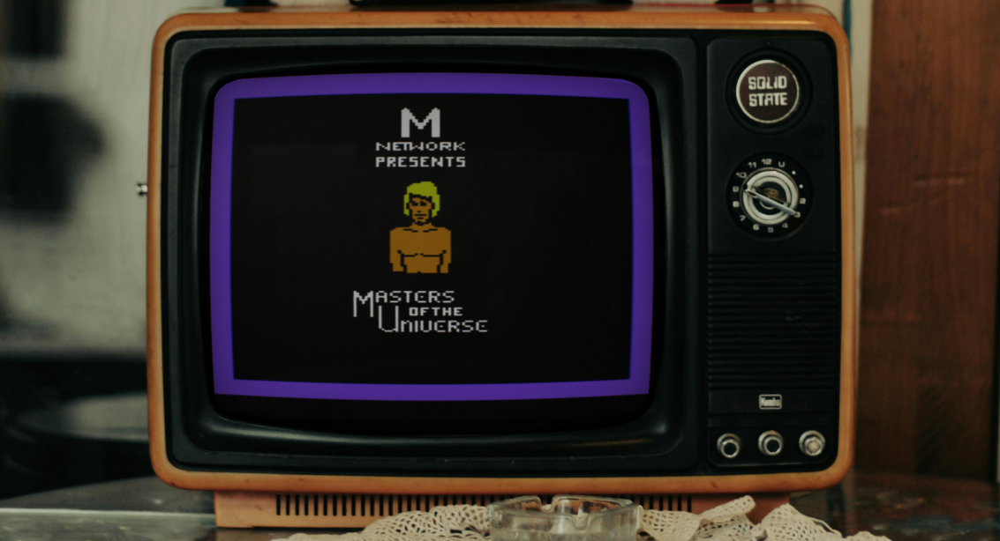
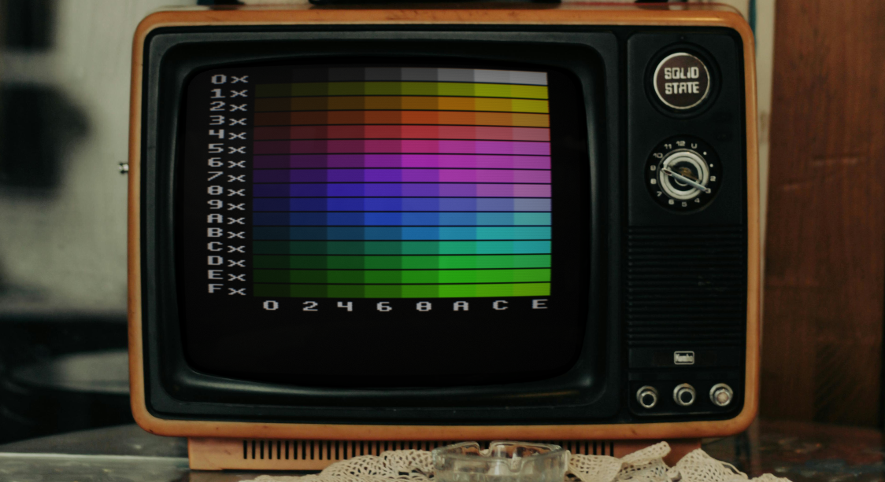

+++
date = '2024-11-23T00:00:00Z'
draft = false
title = 'TV Emulation Improvements'
+++

_This article originally appeared in the "Current Status" page of the Gopher2600 Wiki_

In the previous post I stated that I was putting Gopher2600 into maintenance mode. Some things have changed since then . My original intention was to only fix bugs reported by anybody who uses the emulator. I have in fact made three releases since that time, containing bug fixes and some smaller features.

<!--more-->

So while not "maintenance mode" exactly, I have been working less on the project. But recently I have been working on improving the CRT emulation. My goal for Gopher2600 is now to not only provide an accurate and robust Atari 2600 emulator but to also accurately emulate the television. After all, the television, particularly the CRT television, is an important part of the 2600 games system.

I have experimented with differing bezel options to complement the already existing CRT effects. And I have very recently begun working on authentic colour generation. The early results of both are very promising.

Screen reflections, more visible with a darker picture, help sell the illusion of the CRT glass. The reflections look far better when you can see the emulator running.

The full computationally generated NTSC palette _(all generated colours in these screenshots are work-in-progress)_

I've also solved a long-standing problem with regards to monitor VSYNC under X11. In fact, the whole rendering pipeline is much more robust. All in all, the future of the display for Gopher2600 is looking good. I'm now feeling much more confident in being able to produce a v1.0 of the emulator before long.

_Note that these changes are not yet pushed to the repository_

I'm also considering a project name change for v1.0 because I no longer feel that the name suits the project. Gopher2600 started out partly as an experiment with Go and so emphasising the roots seemed appropriate. However, I think that time has passed and so maybe another name should be adopted.

Moreover, somebody has since released a Nintendo64 emulator called [Gopher64](https://github.com/gopher64/gopher64)! Although, Gopher2600 predates Gopher64, I'm comfortable with the idea of changing the name to ensure the projects are viewed as distinct. Truth be told, I find it bizarre that there are now two separate emulators with similar names. But hey! It doesn't really matter I suppose. I might keep the name yet.
